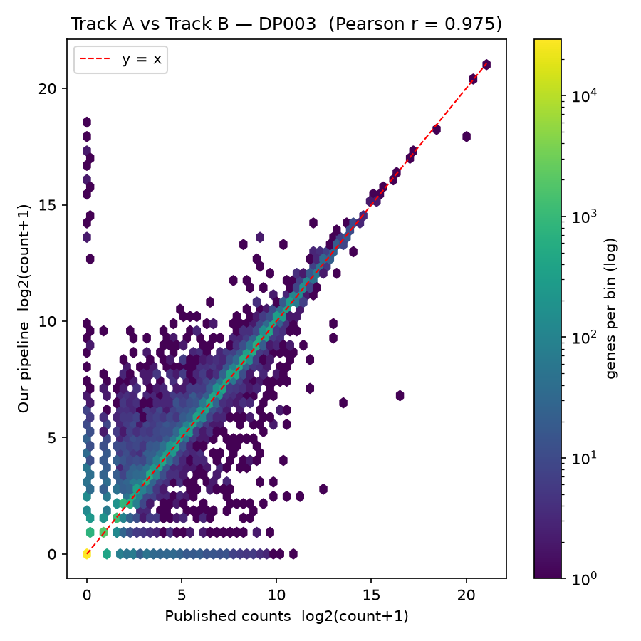
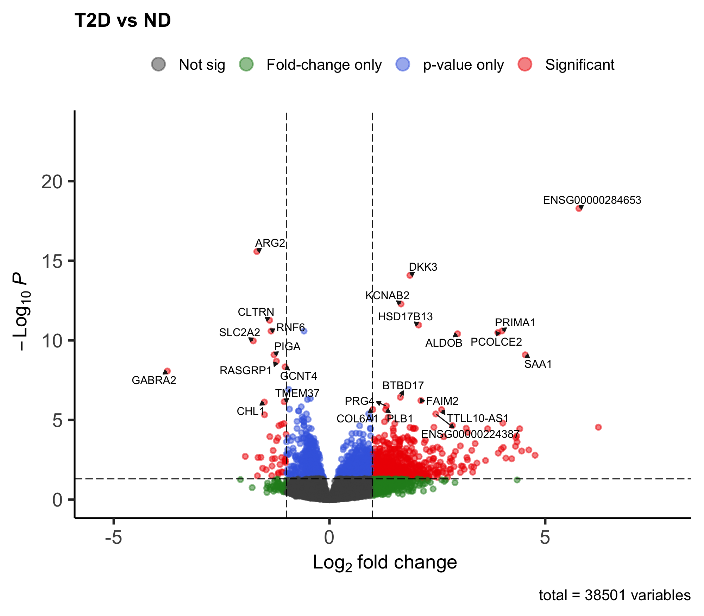
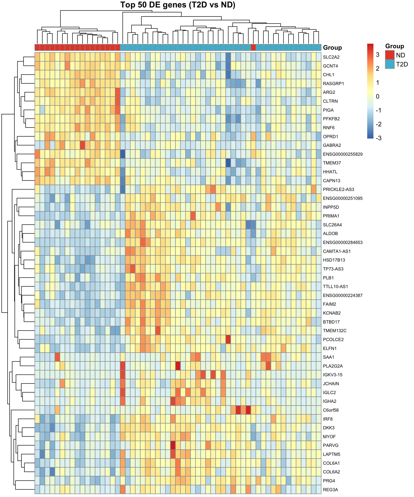
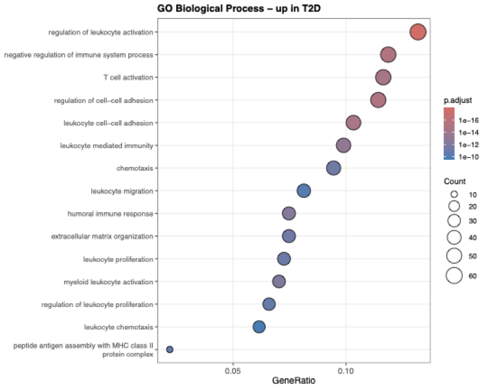
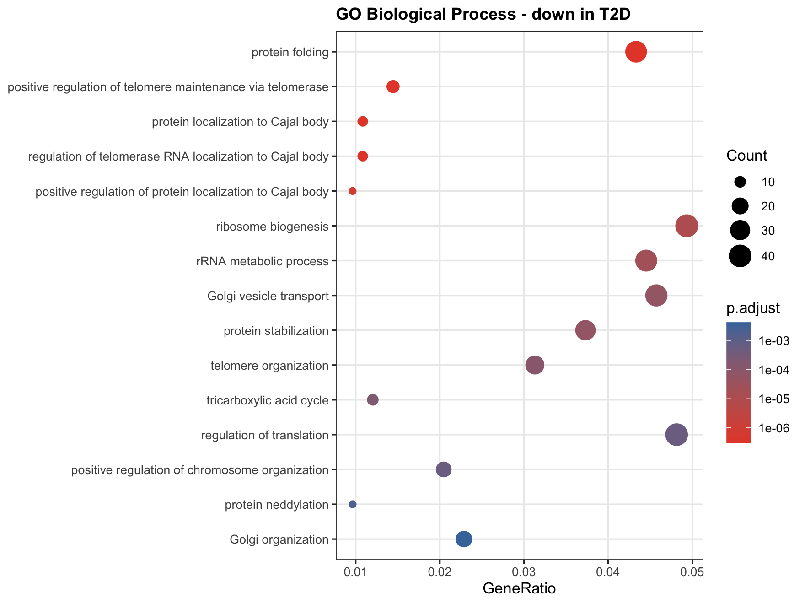
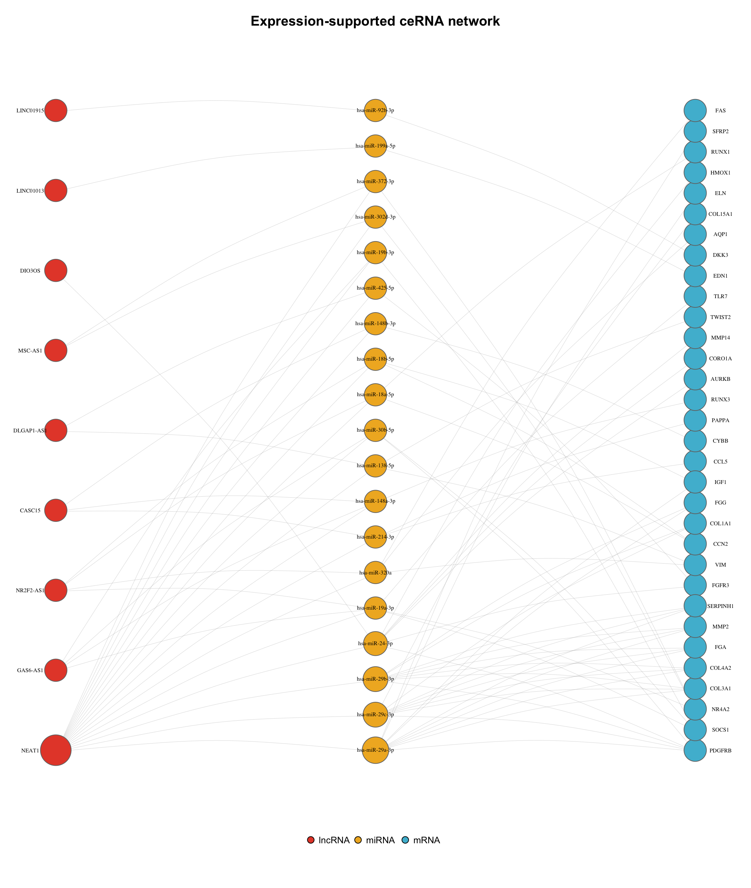
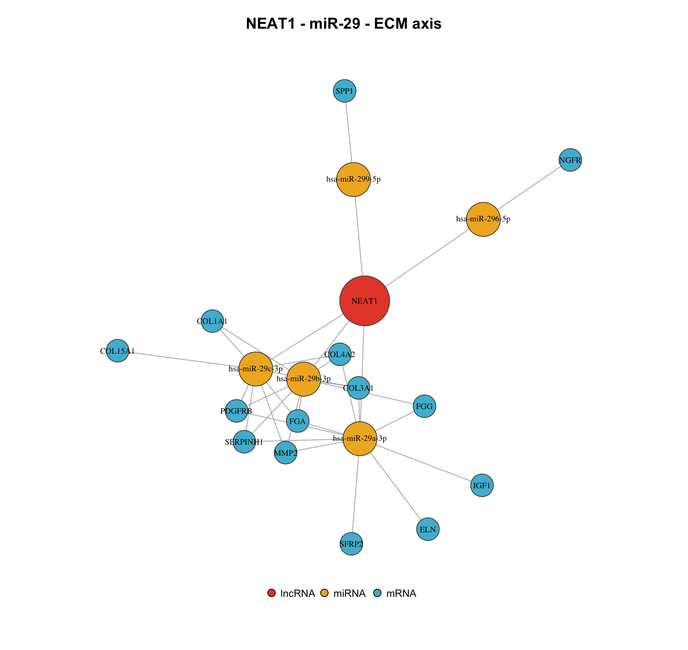

# ceRNA Network Reconstruction in Type 2 Diabetic Pancreatic Islets

A from-scratch, reproducible RNA-seq pipeline for human pancreatic islets that takes raw
sequencing reads all the way to a **competing-endogenous-RNA (ceRNA) network** — identifying
lncRNA → miRNA → mRNA regulatory axes that differ between type-2-diabetic (T2D) and
non-diabetic (ND) donors.

**Reproduction + extension.** I first reproduced the primary processing of
[Wigger et al., *Nature Metabolism* 2021](https://pubmed.ncbi.nlm.nih.gov/34183850/)
from raw FASTQ files — validating my pipeline at **Pearson r = 0.975** against their published
count matrix — and then extended the dataset with a lncRNA/miRNA/mRNA ceRNA analysis the
original authors did not perform.

---

## Key results

| | Result |
|---|---|
| Pipeline validation (my counts vs published) | **mean Pearson r = 0.975** across 12 donors |
| Differentially expressed genes (T2D vs ND) | **726** (515 mRNAs, 125 lncRNAs) |
| Up in T2D | immune activation, leukocyte chemotaxis, MHC-II, **ECM / collagen** |
| Down in T2D | ribosome biogenesis, translation, Golgi transport, **TCA cycle** |
| ceRNA network (expression-supported) | **180 nodes, 238 axes**; 92% of lncRNA–mRNA pairs positively correlated |
| Central axis | **NEAT1 → miR-29 family → collagen / ECM genes** |

---

## The two-track strategy

Aligning 130+ human samples on a laptop is not realistic, so the project runs two tracks:

- **Track A — pipeline demonstration:** download 6 ND + 6 T2D FASTQ samples and run the full
  raw pipeline (QC → trim → align → count). Proves command-line competence end to end.
- **Track B — biology:** run the differential-expression and ceRNA analysis on the **full
  published count matrix** (18 ND vs 39 T2D) for statistical power.

The two tracks are tied together by a validation step: my Track-A counts correlate with the
published counts at **r = 0.975**, confirming the pipeline reproduces the published processing.



---

## Pipeline

```
FASTQ ─▶ QC/trim ─▶ align ─▶ count ─▶ validate      (Track A: FastQC, fastp, HISAT2, featureCounts)
                                         │
published count matrix ──────────────────┼─▶ DESeq2 ─▶ mRNA / lncRNA split
                                                        │
                                          GO/KEGG enrichment
                                                        │
                            miRNA prediction (multiMiR + ENCORI)
                                                        │
                    ceRNA network ─▶ expression-correlation filter ─▶ hubs
```

- **Organism / tissue:** *Homo sapiens*, pancreatic islets (laser-capture microdissected)
- **Data:** GEO **GSE164416**, SRA **PRJNA690574**; single-end SMART-Seq, 76 bp
- **Reference:** GRCh38 (prebuilt HISAT2 index) + Ensembl release 110 annotation

---

## Differential expression

726 genes were significant (padj < 0.05, |log2FC| > 1). Recognisable T2D biology emerged
directly: the beta-cell glucose sensor **SLC2A2 (GLUT2)** is down, while inflammatory
(**SAA1**) and matrix (**COL6A1**) genes are up. The most significant single gene is an
uncharacterised lncRNA (ENSG00000284653).



Clustering the top 50 DE genes across all 57 donors resolves two coherent modules — a
beta-cell-identity module suppressed in T2D and an immune / stress / ECM module induced in
T2D — with immune genes lighting up in only a subset of diabetic donors (patient heterogeneity
visible directly in the data).



### Functional enrichment

Enrichment resolves a two-sided story. **Up in T2D:** organised immune recruitment and
fibrotic remodelling. **Down in T2D:** the biosynthetic and secretory machinery beta cells
depend on (translation, ribosome biogenesis, Golgi transport, TCA cycle) — i.e. impaired
insulin production described at the level of the machinery that performs it.

| Up in T2D | Down in T2D |
|---|---|
|  |  |

*(KEGG corroborated the immune signature; note that KEGG's disease-named pathways reflect
shared immune gene sets, not literal diagnoses — see `results/tables/KEGG.csv`.)*

---

## ceRNA network

miRNA–mRNA edges were taken from **multiMiR** (miRTarBase, gold-standard *Functional MTI* only)
and lncRNA–miRNA edges from the **ENCORI** CLIP-seq API. Joining them through shared miRNAs
produced a network of 208 nodes / 336 axes.

The network was then **filtered against the expression data itself**: an axis was retained
only where the lncRNA and mRNA are positively correlated across the 57 donors (Spearman,
padj < 0.05). **92% of pairs showed the predicted positive correlation** (p = 5e-28), and
238 axes (71%) survived. To rule out confounding by the ND/T2D group difference, correlations
were recomputed **within T2D donors alone**: 80% remained positive (p = 1e-13; agreement
ρ = 0.93 with the all-donor analysis), indicating within-disease co-variation rather than
group separation alone. Hub rankings were unchanged by filtering.



### Central axis: NEAT1 → miR-29 → ECM

The dominant, filter-robust axis is **NEAT1** (a well-characterised sponge lncRNA, up in T2D)
sponging the **miR-29 family**, whose validated targets are **collagens and ECM genes**
(COL1A1, COL3A1, COL4A2, SERPINH1, ELN, MMP2, PDGFRB). miR-29 is the canonical anti-fibrotic
miRNA family, so this axis is a coherent, literature-supported mechanism for the ECM
up-regulation seen independently in the differential-expression and enrichment results.



---

## Reproduce it

```bash
# 1. environment (conda / Miniforge)
conda env create -f environment.yml
conda activate rnaseq

# 2. R packages (in R): DESeq2, EnhancedVolcano, clusterProfiler, org.Hs.eg.db,
#    pheatmap, multiMiR, igraph, data.table  (see docs/methods.md)

# 3. run the whole pipeline
bash run_all.sh
```

Open `diabetes-cerna-rnaseq.Rproj` in RStudio so the working directory is set automatically,
then run the R scripts (`07`–`15`) in order, or let `run_all.sh` drive them via `Rscript`.

---

## Repository layout

```
scripts/         01_download → 15_network_supported  (numbered pipeline order)
data/            raw FASTQ, reference, processed matrices (large files gitignored)
results/tables/  count matrices, DE tables, ceRNA edges, hub tables
results/figures/ volcano, heatmap, GO dotplots, network, validation scatter (+ png/)
docs/            methods.md, how_to_read_qc.md
run_all.sh       one-command pipeline
environment.yml  conda spec
```

---

## Limitations

- **Mature miRNAs are not measured.** Standard RNA-seq does not capture them; the miRNA layer
  is inferred from curated interaction databases. The natural next step is matched
  small-RNA-seq to quantify miRNAs directly, plus qRT-PCR / reporter validation of the
  NEAT1–miR-29 axis.
- **Bulk laser-captured tissue.** The immune signal partly reflects differences in cell-type
  composition (immune infiltrate in a subset of donors) rather than beta-cell-intrinsic change.
- **Positive lncRNA–mRNA correlation** is consistent with ceRNA activity but also with shared
  upstream regulation; it supports, but does not prove, sponging.
- **59 of 125 DE lncRNAs** have no gene symbol and could not be queried for miRNA interactions.

---

## References

- Wigger et al. *Multi-omics profiling of living human pancreatic islet donors reveals
  heterogeneous beta cell trajectories towards type 2 diabetes.* **Nature Metabolism** 2021.
  [PMID 34183850](https://pubmed.ncbi.nlm.nih.gov/34183850/)
- multiMiR — https://bioconductor.org/packages/multiMiR/
- ENCORI / starBase — https://rnasysu.com/encori/
- Data: [GSE164416](https://www.ncbi.nlm.nih.gov/geo/query/acc.cgi?acc=GSE164416)

---

*Author: Aqsa Hamdani. Secondary analysis of public data (GSE164416); please cite Wigger et al.
for the original dataset.*
